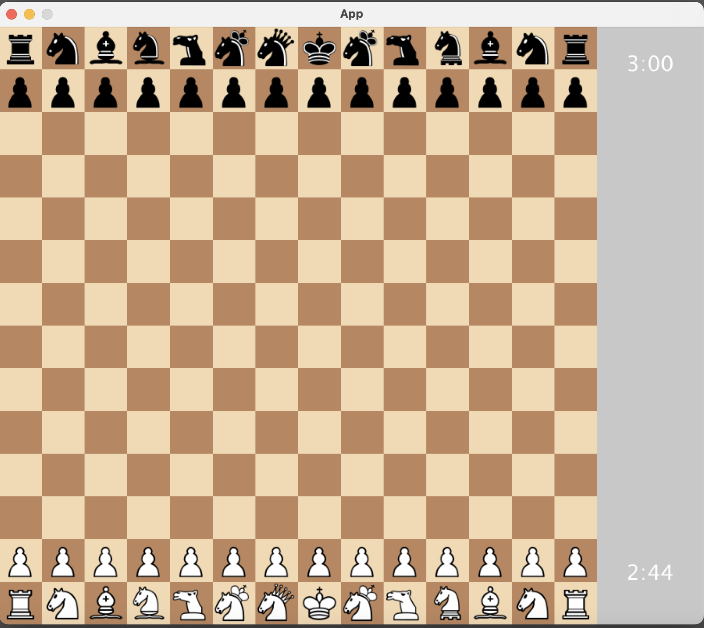

# XXLChess: A Variant Chess Game

## Overview

Welcome to XXLChess! This is not your typical chess game; it's an XXL version that takes the classic game to new heights. Developed in Java and utilizing the Processing library for graphics, this game features a 14x14 board. The game is managed through Gradle, making dependency management a breeze.

## Features

### XXL Board and Gameplay

- The XXL board consists of a 14x14 grid of tiles, each 48x48 pixels.
- A right sidebar of 120 pixels is reserved for timers and game messages.
- The board features a checkerboard pattern with alternating black and white tiles.
- Highlights for possible moves, captures, and checks are available.

### Configuration

- A `config.json` file in the root directory contains various game settings.
- Time controls for both players are configurable.
- The player's color (black or white) can be set.

### Extended Chess Pieces

- Multiple types of chess pieces, including some unique to XXLChess, each with their own movement patterns.
- Special moves like castling and pawn promotion are supported.
- Chess pieces have different point values.

### Win and Lose Conditions

- The game ends when a player runs out of time or gets checkmated.
- Messages are displayed to indicate the game's outcome.

## Installation and Running

1. Clone the repository.
2. Navigate to the project directory.
3. Run `gradle build` to compile and resolve dependencies.
4. Run `gradle run` to start the game.

## Requirements

- Java 1.8
- Gradle
- Processing library

## Usage

- Use the mouse to select and move chess pieces.
- Follow the highlights to understand possible moves and captures.
- Keep an eye on the timer and make your moves accordingly.

## Customization

- You can modify the `config.json` file to change various game settings.
- Feel free to add new chess pieces or change the existing ones.

## Contributing

Pull requests are welcome. For major changes, please open an issue first to discuss what you would like to change.

## License

This project is licensed under the MIT License - see the [LICENSE](LICENSE) file for details.

---

Feel free to use this updated README.md for your GitHub repository. Let me know if you need any more changes!
